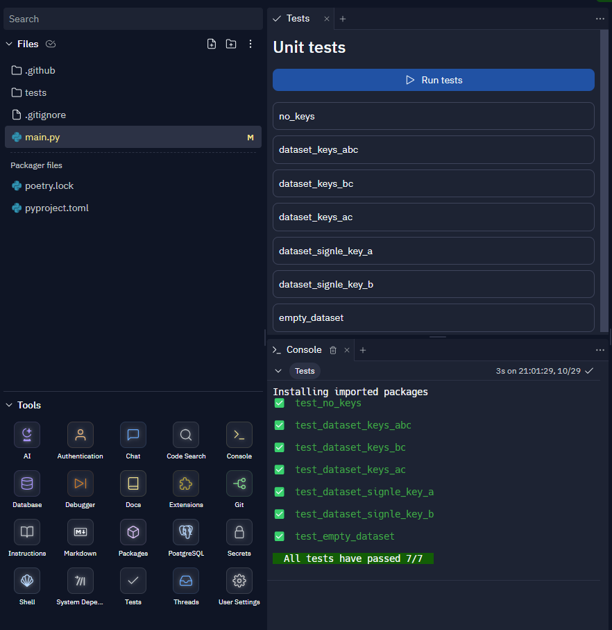

# Instructions

## Overview

| Term        | Meaning                                                |
|:------------|:-------------------------------------------------------|
| `DataSet`   | A list of `DataEntries`, all keys are the same         |
| `DataEntry` | A dictionary with all `str` keys and `Hashable` values |
| `Keys`      | A list of valid keys for `DataEntry` dictionary        |

The `DataEntry` is a simple dictionary with rules applied as follows:

- the dictionary keys are of `str` type
- the dictionary values are of `Hashable` type

As example:

```python
data_entry = {
    "key_1": 1,
    "key_2": True,
    "key_3": (24, 42),
    # and so on
}
```

The `DataSet` is a list a `DataEntry` entities with all of its elements with
the same set of keys. As example:

```python
dataset = [
    {"A": 1, "B": 2, "C": 3},
    {"A": 2, "B": 3, "C": 4},
    {"A": 1, "B": 5, "C": 1},
    # and so on
]
```

### Additional info

1. [Dictionary](https://docs.python.org/3/glossary.html#term-dictionary)
2. [Hashable](https://docs.python.org/3/glossary.html#term-hashable)
3. [Dictionary class](https://docs.python.org/3/library/stdtypes.html#dict)

## Objective

Your task is to create a function, that performs a dataset filtering by unique
values. Only values in a given set of keys should be applied for filtering.
The `DataSet` is the only required argument, if case there is no `Keys` to
filter provided - all available keys will be used.

## Requirements

### Original data

Original data should not be modified while processing.
The function should return a new list object.

### Empty dataset

If `DataSet` is an empty list - return empty list.

```python
from main import filter_by_values

# noinspection PyArgumentList
assert filter_by_values([]) == []
```

### No filtering keys

If `Keys` is an empty list or hasn't been provided - use all available keys
for filtering data.

```python
from main import filter_by_values

dataset = [
    {"A": 1, "B": 3, "C": 2},
    {"A": 1, "B": 3, "C": 1},
    {"A": 3, "B": 2, "C": 2},
    {"A": 3, "B": 1, "C": 1},
    {"A": 2, "B": 3, "C": 1},
    {"A": 2, "B": 1, "C": 1},
    {"A": 3, "B": 2, "C": 2},
    {"A": 2, "B": 2, "C": 3},
    {"A": 3, "B": 3, "C": 3},
]
filtered_dataset = [
    {"A": 1, "B": 3, "C": 2},  # values to check (1, 3, 2)
    {"A": 1, "B": 3, "C": 1},  # values to check (1, 3, 1)
    {"A": 3, "B": 2, "C": 2},  # values to check (3, 2, 2)
    {"A": 3, "B": 1, "C": 1},  # values to check (3, 1, 1)
    {"A": 2, "B": 3, "C": 1},  # values to check (2, 3, 1)
    {"A": 2, "B": 1, "C": 1},  # values to check (2, 1, 1)
    # {"A": 3, "B": 2, "C": 2},  # this one is a duplicate
    {"A": 2, "B": 2, "C": 3},  # values to check (2, 2, 3)
    {"A": 3, "B": 3, "C": 3},  # values to check (3, 3, 3)
]
assert filter_by_values(dataset, []) == filtered_dataset
# noinspection PyArgumentList
assert filter_by_values(dataset) == filtered_dataset
```

### Filtering by a single key

No duplicates in a specified key allowed.

```python
from main import filter_by_values

dataset = [
    {"A": 1, "B": 3, "C": 2},
    {"A": 1, "B": 3, "C": 1},
    {"A": 3, "B": 2, "C": 2},
    {"A": 3, "B": 1, "C": 1},
    {"A": 2, "B": 3, "C": 1},
    {"A": 2, "B": 1, "C": 1},
    {"A": 3, "B": 2, "C": 2},
    {"A": 2, "B": 2, "C": 3},
    {"A": 3, "B": 3, "C": 3},
]
a_filtered_dataset = [
    {"A": 1, "B": 3, "C": 2},  # values to check (1,)
    # {"A": 1, "B": 3, "C": 1},  # this is a duplicate
    {"A": 3, "B": 2, "C": 2},  # values to check (3,)
    # {"A": 3, "B": 1, "C": 1},  # this is a duplicate
    {"A": 2, "B": 3, "C": 1},  # values to check (2,)
    # {"A": 2, "B": 1, "C": 1},  # this is a duplicate
    # {"A": 3, "B": 2, "C": 2},  # this is a duplicate
    # {"A": 2, "B": 2, "C": 3},  # this is a duplicate
    # {"A": 3, "B": 3, "C": 3},  # this is a duplicate
]
b_filtered_dataset = [
    {"A": 1, "B": 3, "C": 2},  # values to check (3,)
    # {"A": 1, "B": 3, "C": 1},  # this is a duplicate
    {"A": 3, "B": 2, "C": 2},  # values to check (2,)
    {"A": 3, "B": 1, "C": 1},  # values to check (1,)
    # {"A": 2, "B": 3, "C": 1},  # this is a duplicate
    # {"A": 2, "B": 1, "C": 1},  # this is a duplicate
    # {"A": 3, "B": 2, "C": 2},  # this is a duplicate
    # {"A": 2, "B": 2, "C": 3},  # this is a duplicate
    # {"A": 3, "B": 3, "C": 3},  # this is a duplicate
]
assert filter_by_values(dataset, ["A"]) == a_filtered_dataset
assert filter_by_values(dataset, ["B"]) == b_filtered_dataset
```

### Filtering by a set of keys

No duplicates in specified keys together allowed.

```python
from main import filter_by_values

dataset = [
    {"A": 1, "B": 3, "C": 2},
    {"A": 1, "B": 3, "C": 1},
    {"A": 3, "B": 2, "C": 2},
    {"A": 3, "B": 1, "C": 1},
    {"A": 2, "B": 3, "C": 1},
    {"A": 2, "B": 1, "C": 1},
    {"A": 3, "B": 2, "C": 2},
    {"A": 2, "B": 2, "C": 3},
    {"A": 3, "B": 3, "C": 3},
]
ac_filtered_dataset = [
    {"A": 1, "B": 3, "C": 2},  # values to check (1, 2)
    {"A": 1, "B": 3, "C": 1},  # values to check (1, 1)
    {"A": 3, "B": 2, "C": 2},  # values to check (3, 2)
    {"A": 3, "B": 1, "C": 1},  # values to check (3, 1)
    {"A": 2, "B": 3, "C": 1},  # values to check (2, 1)
    # {"A": 2, "B": 1, "C": 1},  # this is a duplicate
    # {"A": 3, "B": 2, "C": 2},  # this is a duplicate
    {"A": 2, "B": 2, "C": 3},  # values to check (2, 3)
    {"A": 3, "B": 3, "C": 3},  # values to check (3, 3)
]
bc_filtered_dataset = [
    {"A": 1, "B": 3, "C": 2},  # values to check (3, 2)
    {"A": 1, "B": 3, "C": 1},  # values to check (3, 1)
    {"A": 3, "B": 2, "C": 2},  # values to check (2, 2)
    {"A": 3, "B": 1, "C": 1},  # values to check (1, 1)
    # {"A": 2, "B": 3, "C": 1},  # this is a duplicate
    # {"A": 2, "B": 1, "C": 1},  # this is a duplicate
    # {"A": 3, "B": 2, "C": 2},  # this is a duplicate
    {"A": 2, "B": 2, "C": 3},  # values to check (2, 3)
    {"A": 3, "B": 3, "C": 3},  # values to check (3, 3)
]
assert filter_by_values(dataset, ["A", "C"]) == ac_filtered_dataset
assert filter_by_values(dataset, ["B", "C"]) == bc_filtered_dataset
```

## Run unit tests

In the **Tools** section press **Tests** button.
This will open a tab with all available tests for the assignment.
Pressing **Run tests** button will run tests.
The results will be displayed in the **Console** tab.


