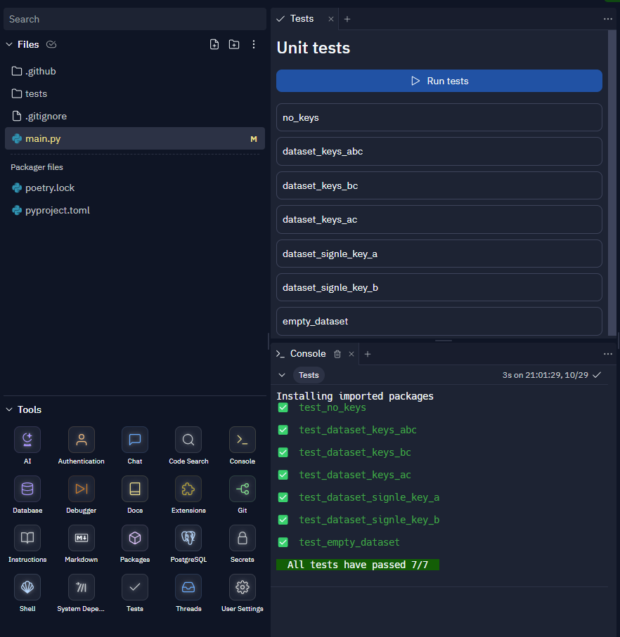

# Інструкції

## Опис

| Термін      | Значення                                              |
| :---------- | :---------------------------------------------------- |
| `DataSet`   | Список `DataEntries`, усі ключі однакові              |
| `DataEntry` | Словник з усіма ключами `str` і значеннями `Hashable` |
| `Keys`      | Список валідних ключів для словника `DataEntry`       |

`DataEntry` - це простий словник із такими правилами:

- ключі словника мають тип `str`
- значення словника мають тип `Hashable`

Як приклад:

```python
data_entry = {
    "key_1": 1,
    "key_2": True,
    "key_3": (24, 42),
    # and so on
}
```

`DataSet` — це список сутностей `DataEntry`, що мають однаковий набір ключів. Як приклад:

```python
dataset = [
    {"A": 1, "B": 2, "C": 3},
    {"A": 2, "B": 3, "C": 4},
    {"A": 1, "B": 5, "C": 1},
    # and so on
]
```

### Додаткова інформація

1. [Dictionary](https://docs.python.org/3/glossary.html#term-dictionary)
2. [Hashable](https://docs.python.org/3/glossary.html#term-hashable)
3. [Клас словника](https://docs.python.org/3/library/stdtypes.html#dict)

## Завдання

Ваше завдання — створити функцію, яка виконує фільтрацію набору даних за унікальними значеннями
. Для фільтрації слід застосовувати лише значення в заданому наборі ключів.
`DataSet` є єдиним обов’язковим аргументом, якщо не надано фільтр `Keys`,
будуть використані всі доступні ключі.

## Вимоги

### Вхідні дані

Вхідні дані не повинні бути змінені під час обробки.
Функція має повернути новий список.

### Порожній набір даних

Якщо `DataSet` є порожнім списком - повертає порожній список.

```python
from main import filter_by_values

# noinspection PyArgumentList
assert filter_by_values([]) == []
```

### Немає ключів для фільтрації

Якщо `Ключі` є порожнім списком або не були надані, використовуйте всі доступні ключі
для фільтрації даних.

```python
from main import filter_by_values

dataset = [
    {"A": 1, "B": 3, "C": 2},
    {"A": 1, "B": 3, "C": 1},
    {"A": 3, "B": 2, "C": 2},
    {"A": 3, "B": 1, "C": 1},
    {"A": 2, "B": 3, "C": 1},
    {"A": 2, "B": 1, "C": 1},
    {"A": 3, "B": 2, "C": 2},
    {"A": 2, "B": 2, "C": 3},
    {"A": 3, "B": 3, "C": 3},
]
filtered_dataset = [
    {"A": 1, "B": 3, "C": 2},  # values to check (1, 3, 2)
    {"A": 1, "B": 3, "C": 1},  # values to check (1, 3, 1)
    {"A": 3, "B": 2, "C": 2},  # values to check (3, 2, 2)
    {"A": 3, "B": 1, "C": 1},  # values to check (3, 1, 1)
    {"A": 2, "B": 3, "C": 1},  # values to check (2, 3, 1)
    {"A": 2, "B": 1, "C": 1},  # values to check (2, 1, 1)
    # {"A": 3, "B": 2, "C": 2},  # this one is a duplicate
    {"A": 2, "B": 2, "C": 3},  # values to check (2, 2, 3)
    {"A": 3, "B": 3, "C": 3},  # values to check (3, 3, 3)
]
assert filter_by_values(dataset, []) == filtered_dataset
# noinspection PyArgumentList
assert filter_by_values(dataset) == filtered_dataset
```

### Фільтрування одним ключем

У вказаному ключі дублікати не допускаються.

```python
from main import filter_by_values

dataset = [
    {"A": 1, "B": 3, "C": 2},
    {"A": 1, "B": 3, "C": 1},
    {"A": 3, "B": 2, "C": 2},
    {"A": 3, "B": 1, "C": 1},
    {"A": 2, "B": 3, "C": 1},
    {"A": 2, "B": 1, "C": 1},
    {"A": 3, "B": 2, "C": 2},
    {"A": 2, "B": 2, "C": 3},
    {"A": 3, "B": 3, "C": 3},
]
a_filtered_dataset = [
    {"A": 1, "B": 3, "C": 2},  # values to check (1,)
    # {"A": 1, "B": 3, "C": 1},  # this is a duplicate
    {"A": 3, "B": 2, "C": 2},  # values to check (3,)
    # {"A": 3, "B": 1, "C": 1},  # this is a duplicate
    {"A": 2, "B": 3, "C": 1},  # values to check (2,)
    # {"A": 2, "B": 1, "C": 1},  # this is a duplicate
    # {"A": 3, "B": 2, "C": 2},  # this is a duplicate
    # {"A": 2, "B": 2, "C": 3},  # this is a duplicate
    # {"A": 3, "B": 3, "C": 3},  # this is a duplicate
]
b_filtered_dataset = [
    {"A": 1, "B": 3, "C": 2},  # values to check (3,)
    # {"A": 1, "B": 3, "C": 1},  # this is a duplicate
    {"A": 3, "B": 2, "C": 2},  # values to check (2,)
    {"A": 3, "B": 1, "C": 1},  # values to check (1,)
    # {"A": 2, "B": 3, "C": 1},  # this is a duplicate
    # {"A": 2, "B": 1, "C": 1},  # this is a duplicate
    # {"A": 3, "B": 2, "C": 2},  # this is a duplicate
    # {"A": 2, "B": 2, "C": 3},  # this is a duplicate
    # {"A": 3, "B": 3, "C": 3},  # this is a duplicate
]
assert filter_by_values(dataset, ["A"]) == a_filtered_dataset
assert filter_by_values(dataset, ["B"]) == b_filtered_dataset
```

### Фільтрація за набором ключів

Не допускаються повторення значень разом в указаних ключах.

```python
from main import filter_by_values

dataset = [
    {"A": 1, "B": 3, "C": 2},
    {"A": 1, "B": 3, "C": 1},
    {"A": 3, "B": 2, "C": 2},
    {"A": 3, "B": 1, "C": 1},
    {"A": 2, "B": 3, "C": 1},
    {"A": 2, "B": 1, "C": 1},
    {"A": 3, "B": 2, "C": 2},
    {"A": 2, "B": 2, "C": 3},
    {"A": 3, "B": 3, "C": 3},
]
ac_filtered_dataset = [
    {"A": 1, "B": 3, "C": 2},  # values to check (1, 2)
    {"A": 1, "B": 3, "C": 1},  # values to check (1, 1)
    {"A": 3, "B": 2, "C": 2},  # values to check (3, 2)
    {"A": 3, "B": 1, "C": 1},  # values to check (3, 1)
    {"A": 2, "B": 3, "C": 1},  # values to check (2, 1)
    # {"A": 2, "B": 1, "C": 1},  # this is a duplicate
    # {"A": 3, "B": 2, "C": 2},  # this is a duplicate
    {"A": 2, "B": 2, "C": 3},  # values to check (2, 3)
    {"A": 3, "B": 3, "C": 3},  # values to check (3, 3)
]
bc_filtered_dataset = [
    {"A": 1, "B": 3, "C": 2},  # values to check (3, 2)
    {"A": 1, "B": 3, "C": 1},  # values to check (3, 1)
    {"A": 3, "B": 2, "C": 2},  # values to check (2, 2)
    {"A": 3, "B": 1, "C": 1},  # values to check (1, 1)
    # {"A": 2, "B": 3, "C": 1},  # this is a duplicate
    # {"A": 2, "B": 1, "C": 1},  # this is a duplicate
    # {"A": 3, "B": 2, "C": 2},  # this is a duplicate
    {"A": 2, "B": 2, "C": 3},  # values to check (2, 3)
    {"A": 3, "B": 3, "C": 3},  # values to check (3, 3)
]
assert filter_by_values(dataset, ["A", "C"]) == ac_filtered_dataset
assert filter_by_values(dataset, ["B", "C"]) == bc_filtered_dataset
```

## Запуск тестів

У розділі **Tools** натисніть кнопку **Tests**.
Відкриється вкладка з усіма доступними тестами для завдання.
Натискання кнопки **Запустити тести** запускає тести.
Результати відображатимуться у вкладці **Консоль**.


